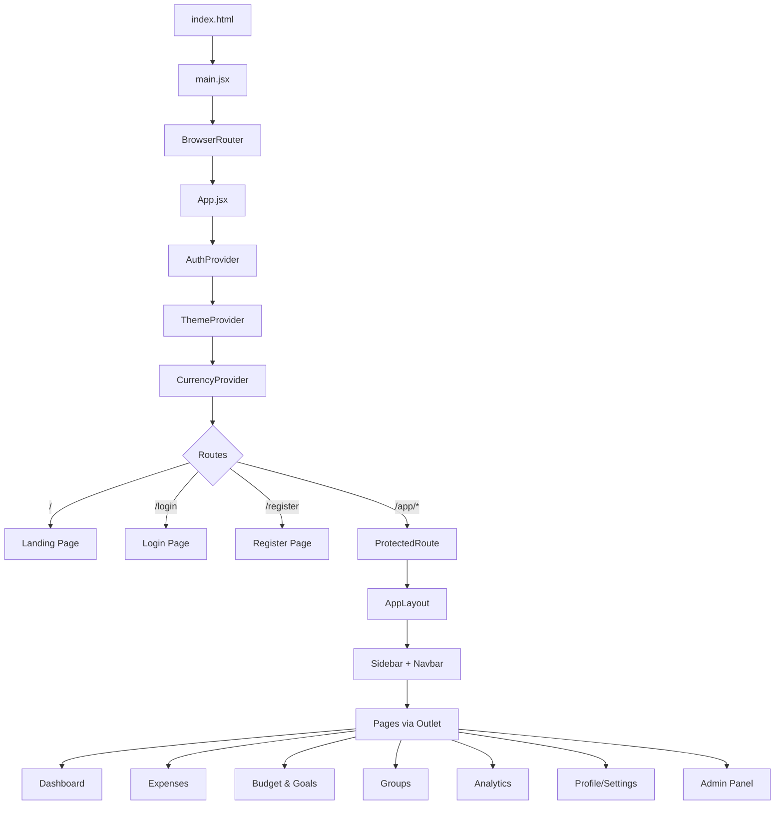
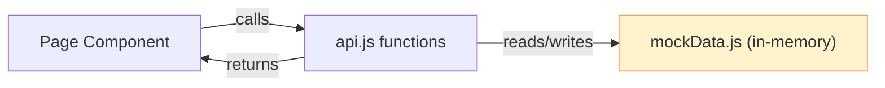
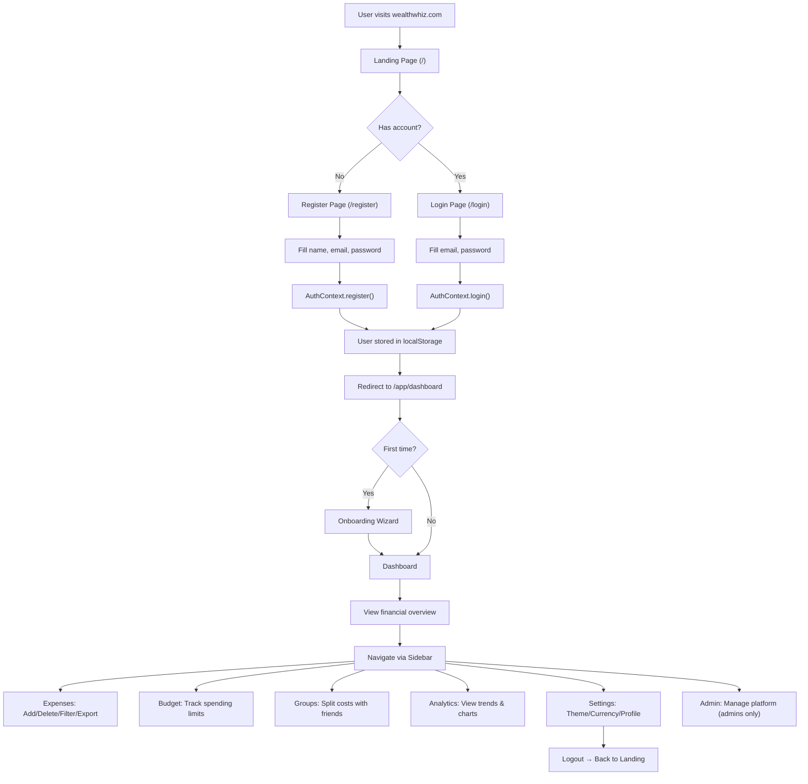

# WealthWhiz — Detailed Website Workflow

## What is WealthWhiz?

**WealthWhiz** is a **Student Finance Management Platform** built as a single-page application (SPA). It helps students track expenses, manage budgets, split group costs, set savings goals, and gain financial insights — all in one place.

| Stack | Technology |
|-------|-----------|
| Framework | **React 19** + **Vite 7** |
| Routing | React Router v7 |
| Styling | Bootstrap 5 + Custom CSS (dark/light theming) |
| Charts | Chart.js + react-chartjs-2 |
| Data | Mock data layer (no backend yet) |
| Deployment | Vercel |

---

## High-Level Architecture



---

## Detailed Workflow — Step by Step

### 1. Application Bootstrap

```
index.html → loads /src/main.jsx → mounts React app into #root
```

[main.jsx](file:///d:/Study/Sem%206/Web%20Programming%20(3160713)/Cipat/wealthwhiz/src/main.jsx) does three things:
1. Imports global styles: **Bootstrap CSS** → **theme.css** → **global.css** → **bootstrap-overrides.css**
2. Wraps the app in `<StrictMode>` and `<BrowserRouter>`
3. Renders `<App />`

---

### 2. Context Providers (Global State)

[App.jsx](file:///d:/Study/Sem%206/Web%20Programming%20(3160713)/Cipat/wealthwhiz/src/App.jsx) wraps everything in **three nested context providers**:

| Provider | File | Purpose | Persistence |
|----------|------|---------|-------------|
| [AuthProvider](file:///d:/Study/Sem%206/Web%20Programming%20%283160713%29/Cipat/wealthwhiz/src/context/AuthContext.jsx#16-63) | [AuthContext.jsx](file:///d:/Study/Sem%206/Web%20Programming%20(3160713)/Cipat/wealthwhiz/src/context/AuthContext.jsx) | Manages user login/register/logout, stores user object, role-based access | `localStorage` (`ww_auth`) |
| [ThemeProvider](file:///d:/Study/Sem%206/Web%20Programming%20%283160713%29/Cipat/wealthwhiz/src/context/ThemeContext.jsx#5-25) | [ThemeContext.jsx](file:///d:/Study/Sem%206/Web%20Programming%20(3160713)/Cipat/wealthwhiz/src/context/ThemeContext.jsx) | Toggles **Light/Dark** theme, sets `data-theme` attribute on `<html>` | `localStorage` (`ww_theme`) |
| [CurrencyProvider](file:///d:/Study/Sem%206/Web%20Programming%20%283160713%29/Cipat/wealthwhiz/src/context/CurrencyContext.jsx#7-53) | [CurrencyContext.jsx](file:///d:/Study/Sem%206/Web%20Programming%20(3160713)/Cipat/wealthwhiz/src/context/CurrencyContext.jsx) | Multi-currency support (**INR, USD, EUR, GBP**), fetches live exchange rates from Frankfurter API | `localStorage` (`ww_currency`) |

---

### 3. Routing System

The app has **two route zones**:

#### Public Routes (no authentication needed)
| Route | Page | Purpose |
|-------|------|---------|
| `/` | [LandingPage](file:///d:/Study/Sem%206/Web%20Programming%20%283160713%29/Cipat/wealthwhiz/src/pages/Landing/LandingPage.jsx#5-120) | Marketing page with Hero, Features, Pricing sections |
| `/login` | [LoginPage](file:///d:/Study/Sem%206/Web%20Programming%20%283160713%29/Cipat/wealthwhiz/src/pages/Auth/LoginPage.jsx#8-112) | Email + password sign-in form |
| `/register` | `RegisterPage` | Account creation form |

#### Protected Routes (requires login)
All routes under `/app/*` are wrapped in a [ProtectedRoute](file:///d:/Study/Sem%206/Web%20Programming%20%283160713%29/Cipat/wealthwhiz/src/App.jsx#21-27) component that checks `isAuthenticated` from `AuthContext`. If not logged in → redirects to `/login`.

| Route | Page | Purpose |
|-------|------|---------|
| `/app/dashboard` | [Dashboard](file:///d:/Study/Sem%206/Web%20Programming%20%283160713%29/Cipat/wealthwhiz/src/pages/Dashboard/Dashboard.jsx#17-194) | Financial overview with summary cards & charts |
| `/app/expenses` | [ExpenseList](file:///d:/Study/Sem%206/Web%20Programming%20%283160713%29/Cipat/wealthwhiz/src/pages/Expenses/ExpenseList.jsx#17-265) | Full CRUD for expense transactions |
| `/app/budget` | [BudgetPage](file:///d:/Study/Sem%206/Web%20Programming%20%283160713%29/Cipat/wealthwhiz/src/pages/Budget/BudgetPage.jsx#10-135) | Budget tracking + savings goals |
| `/app/groups` | [GroupList](file:///d:/Study/Sem%206/Web%20Programming%20%283160713%29/Cipat/wealthwhiz/src/pages/Groups/GroupList.jsx#9-105) | Group expense splitting |
| `/app/analytics` | [AnalyticsPage](file:///d:/Study/Sem%206/Web%20Programming%20%283160713%29/Cipat/wealthwhiz/src/pages/Analytics/AnalyticsPage.jsx#14-111) | Charts & financial trend analysis |
| `/app/profile` | [ProfilePage](file:///d:/Study/Sem%206/Web%20Programming%20%283160713%29/Cipat/wealthwhiz/src/pages/Profile/ProfilePage.jsx#9-94) | User settings, theme, currency, password |
| `/app/admin` | [AdminDashboard](file:///d:/Study/Sem%206/Web%20Programming%20%283160713%29/Cipat/wealthwhiz/src/pages/Admin/AdminDashboard.jsx#20-154) | Platform admin panel (admin role only) |

Any unknown route (`/*`) redirects to `/`.

---

### 4. Application Layout (Protected Area)

When a user is authenticated and navigates to `/app/*`, [AppLayout.jsx](file:///d:/Study/Sem%206/Web%20Programming%20(3160713)/Cipat/wealthwhiz/src/layouts/AppLayout.jsx) renders:

```
┌────────────────────────────────────────────────┐
│  OnboardingWizard (shown once for new users)   │
├──────────┬─────────────────────────────────────┤
│          │  Navbar (search, theme, profile)     │
│ Sidebar  ├─────────────────────────────────────┤
│ (nav     │                                     │
│  links)  │  <Outlet /> (page content)          │
│          │                                     │
└──────────┴─────────────────────────────────────┘
```

- **Sidebar** — Navigation links (Dashboard, Expenses, Budget, Groups, Analytics, Settings). Admin link visible only if `isAdmin === true`.
- **Navbar** — Hamburger menu toggle, global search bar, theme toggle, notifications badge, profile dropdown (Settings / Logout).
- **OnboardingWizard** — First-time user guide, shown once and then dismissed (tracked in `localStorage`).

---

### 5. Data Flow (API Service Layer)

All data operations go through [api.js](file:///d:/Study/Sem%206/Web%20Programming%20(3160713)/Cipat/wealthwhiz/src/services/api.js), which currently uses **mock data** from [mockData.js](file:///d:/Study/Sem%206/Web%20Programming%20(3160713)/Cipat/wealthwhiz/src/services/mockData.js) with simulated network delays (~400ms).



| Module | API Functions | Operations |
|--------|--------------|------------|
| Dashboard | [fetchDashboard()](file:///d:/Study/Sem%206/Web%20Programming%20%283160713%29/Cipat/wealthwhiz/src/services/api.js#8-15) | Read-only summary data |
| Expenses | [fetchExpenses()](file:///d:/Study/Sem%206/Web%20Programming%20%283160713%29/Cipat/wealthwhiz/src/services/api.js#21-34), [addExpense()](file:///d:/Study/Sem%206/Web%20Programming%20%283160713%29/Cipat/wealthwhiz/src/services/api.js#35-41), [updateExpense()](file:///d:/Study/Sem%206/Web%20Programming%20%283160713%29/Cipat/wealthwhiz/src/services/api.js#42-49), [deleteExpense()](file:///d:/Study/Sem%206/Web%20Programming%20%283160713%29/Cipat/wealthwhiz/src/services/api.js#50-55) | Full CRUD + filtering |
| Budgets | [fetchBudgets()](file:///d:/Study/Sem%206/Web%20Programming%20%283160713%29/Cipat/wealthwhiz/src/services/api.js#61-65), [addBudget()](file:///d:/Study/Sem%206/Web%20Programming%20%283160713%29/Cipat/wealthwhiz/src/services/api.js#66-72), [updateBudget()](file:///d:/Study/Sem%206/Web%20Programming%20%283160713%29/Cipat/wealthwhiz/src/services/api.js#73-80) | Create, read, update |
| Goals | [fetchGoals()](file:///d:/Study/Sem%206/Web%20Programming%20%283160713%29/Cipat/wealthwhiz/src/services/api.js#86-90), [addGoal()](file:///d:/Study/Sem%206/Web%20Programming%20%283160713%29/Cipat/wealthwhiz/src/services/api.js#91-97), [updateGoal()](file:///d:/Study/Sem%206/Web%20Programming%20%283160713%29/Cipat/wealthwhiz/src/services/api.js#98-105) | Create, read, update |
| Groups | [fetchGroups()](file:///d:/Study/Sem%206/Web%20Programming%20%283160713%29/Cipat/wealthwhiz/src/services/api.js#111-115), [fetchGroupById()](file:///d:/Study/Sem%206/Web%20Programming%20%283160713%29/Cipat/wealthwhiz/src/services/api.js#116-122), [addGroupExpense()](file:///d:/Study/Sem%206/Web%20Programming%20%283160713%29/Cipat/wealthwhiz/src/services/api.js#123-130) | Read + add group expenses |
| Analytics | [fetchAnalytics()](file:///d:/Study/Sem%206/Web%20Programming%20%283160713%29/Cipat/wealthwhiz/src/services/api.js#131-138) | Read-only trend & breakdown data |

> [!NOTE]
> The API layer is designed to be swapped out for real REST/GraphQL calls when a backend is built — all functions are `async` and return Promises.

---

### 6. Page-by-Page Workflow

#### 🏠 Landing Page (`/`)
Marketing page with: nav bar, hero section with animated mockup cards, 6 feature cards with staggered animations, 3-tier pricing (Free/Pro/Team), and footer.

#### 🔐 Login (`/login`) & Register (`/register`)
- Uses [useForm](file:///d:/Study/Sem%206/Web%20Programming%20%283160713%29/Cipat/wealthwhiz/src/hooks/useForm.js#3-72) custom hook for form state + validation
- Validates email format and required fields
- On success → calls `AuthContext.login()` → stores user in `localStorage` → redirects to `/app/dashboard`
- Google OAuth button (UI only, not functional yet)

#### 📊 Dashboard (`/app/dashboard`)
1. Fetches summary data via [fetchDashboard()](file:///d:/Study/Sem%206/Web%20Programming%20%283160713%29/Cipat/wealthwhiz/src/services/api.js#8-15)
2. Shows 4 **summary cards**: Total Income, Total Expenses, Balance, Savings
3. **Line chart** — 6-month income vs expense trend
4. **Doughnut chart** — Spending by category
5. **Recent transactions table** — Last 5 expenses with category icons

#### 💰 Expenses (`/app/expenses`)
1. Fetches all expenses via [fetchExpenses()](file:///d:/Study/Sem%206/Web%20Programming%20%283160713%29/Cipat/wealthwhiz/src/services/api.js#21-34)
2. **Filter bar**: search (debounced), category dropdown, date range pickers
3. **Expense table** with category, description, date, payment method, amount, delete action
4. **Add Expense modal** — Form with amount, category, date, description, payment method, recurring flag
5. **Export** — Opens ExportModal to download as CSV/JSON
6. Shows `EmptyState` when no results match filters

#### 🎯 Budget & Goals (`/app/budget`)
1. Fetches budgets and goals in parallel
2. **Budget alerts** banner — warns when spending ≥80% of allocated budget
3. **Budget cards grid** — Per-category progress bars with color coding (green → yellow → red)
4. **Savings goals** — Visual progress cards with target amounts, saved amounts, and deadlines

#### 👥 Groups (`/app/groups`)
1. Fetches group data via [fetchGroups()](file:///d:/Study/Sem%206/Web%20Programming%20%283160713%29/Cipat/wealthwhiz/src/services/api.js#111-115)
2. **Group cards** — Shows group name, member count, total expenses, per-member balance (owes/gets back)
3. **Group detail view** — Drills into a group to see expense table + member balance breakdown
4. Supports equal, custom, and percentage split types

#### 📈 Analytics (`/app/analytics`)
1. Fetches analytics data via [fetchAnalytics()](file:///d:/Study/Sem%206/Web%20Programming%20%283160713%29/Cipat/wealthwhiz/src/services/api.js#131-138)
2. **Stats row** — Total Income, Total Expenses, Net Savings, Avg Monthly Spend
3. **3 charts**: Line chart (monthly trend), Bar chart (income vs expenses), Doughnut (category breakdown)
4. Period selector (3 months / 6 months / 1 year)

#### ⚙️ Profile/Settings (`/app/profile`)
- Edit name (email is readonly)
- **Theme selector** — Light/Dark toggle buttons
- **Currency selector** — INR/USD/EUR/GBP with live conversion
- Change password form
- **Danger zone** — Delete account button

#### 🛡️ Admin Dashboard (`/app/admin`)
Visible only to users with `role === 'platform_admin'`. Three tabs:
- **Overview** — Platform stats (total users, active today, expenses logged, system health) + system status indicators
- **Users** — User management table with role badges, status badges, edit/suspend actions
- **Audit Logs** — Activity log with action, user, timestamp, IP address

---

### 7. Shared Components

| Component | Purpose |
|-----------|---------|
| [Navbar.jsx](file:///d:/Study/Sem%206/Web%20Programming%20(3160713)/Cipat/wealthwhiz/src/components/Navbar.jsx) | Top navigation bar with search, theme toggle, notifications, profile dropdown |
| [Sidebar.jsx](file:///d:/Study/Sem%206/Web%20Programming%20(3160713)/Cipat/wealthwhiz/src/components/Sidebar.jsx) | Left navigation with links and admin section |
| [Toast.jsx](file:///d:/Study/Sem%206/Web%20Programming%20(3160713)/Cipat/wealthwhiz/src/components/Toast.jsx) | Success/error notification popups |
| `ExportModal` | Modal for exporting data as CSV or JSON |
| `OnboardingWizard` | First-time user walkthrough wizard |
| `SkeletonLoader` | Loading placeholder animations (table & card variants) |
| `EmptyState` | "No data" placeholder with optional action button |
| `LoadingSpinner` | Full-page loading indicator |

---

### 8. Custom Hooks

| Hook | File | Purpose |
|------|------|---------|
| [useForm](file:///d:/Study/Sem%206/Web%20Programming%20%283160713%29/Cipat/wealthwhiz/src/hooks/useForm.js#3-72) | [useForm.js](file:///d:/Study/Sem%206/Web%20Programming%20(3160713)/Cipat/wealthwhiz/src/hooks/useForm.js) | Form state management with validation, blur tracking, and field-level errors |
| `useDebounce` | [useDebounce.js](file:///d:/Study/Sem%206/Web%20Programming%20(3160713)/Cipat/wealthwhiz/src/hooks/useDebounce.js) | Delays value updates (used for search input) |
| `useFetch` | [useFetch.js](file:///d:/Study/Sem%206/Web%20Programming%20(3160713)/Cipat/wealthwhiz/src/hooks/useFetch.js) | Generic async data fetching with loading/error state |
| `useKeyboardShortcut` | [useKeyboardShortcut.js](file:///d:/Study/Sem%206/Web%20Programming%20(3160713)/Cipat/wealthwhiz/src/hooks/useKeyboardShortcut.js) | Global keyboard shortcut listener |

---

### 9. Utilities

| File | Contents |
|------|----------|
| [constants.js](file:///d:/Study/Sem%206/Web%20Programming%20(3160713)/Cipat/wealthwhiz/src/utils/constants.js) | Category definitions (10 categories with icons/colors), payment methods, currencies, split types, user roles, budget periods |
| [formatters.js](file:///d:/Study/Sem%206/Web%20Programming%20(3160713)/Cipat/wealthwhiz/src/utils/formatters.js) | Currency formatting, date formatting, percentage formatting |
| [validators.js](file:///d:/Study/Sem%206/Web%20Programming%20(3160713)/Cipat/wealthwhiz/src/utils/validators.js) | Form validation rules (email, required, amount, date, description) |
| [helpers.js](file:///d:/Study/Sem%206/Web%20Programming%20(3160713)/Cipat/wealthwhiz/src/utils/helpers.js) | ID generation, greeting text, CSV download utility |

---

### 10. Complete User Journey Flow


